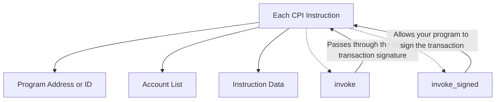

Each CPI instruction must specify the following information:

- **Program Address or ID**: The identifier of the program being called.
- **Account List**: Every account that the instruction reads from or writes to, including accounts of other programs.
- **Instruction Data**: Specifies which instruction on the program to invoke.

CPIs are made using the `invoke` and `invoke_signed` functions from the `solana_program` crate:

- `invoke`: Passes through the original transaction signature.
- `invoke_signed`: Allows your program to sign the transaction.

## Related Links

- For an overview of CPIs, see the [Overview of CPI](overview.md).
- For a detailed guide on implementing CPIs using Anchor, see [Cross-Program Invocations in Solana Using Anchor](index.md).
- For key features of CPIs, see [Key Features](key-features.md).
- For reasons to use CPIs in your projects, see [Why Use Cross-Program Invocation](why.md).
- For practical examples and use cases of CPIs, see [Examples of CPI](examples-of-cpi.md).
- For a step-by-step tutorial on implementing CPIs, see the [Tutorial on Cross-Program Invocation](tutorial.md).
