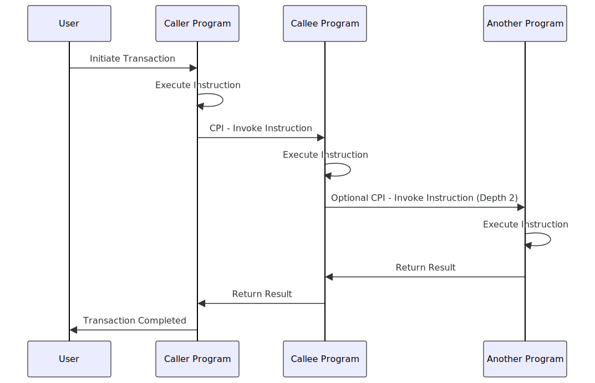

A Cross-Program Invocation (CPI) in Solana allows one program to invoke the instructions of another program, effectively enabling interaction between programs.
Think of CPI as similar to calling an API endpoint, but within the Solana blockchain ecosystem.
A CPI can be considered an internal API call where one program's instruction invokes another program's instruction directly.
This mechanism extends signer privileges from the caller program to the callee program, allowing for more complex interactions.

This sequence shows how CPIs can enable complex interactions between multiple Solana programs, enhancing modularity and composability.

When making a CPI, a program can sign on behalf of a Program Derived Address (PDA).
Additionally, the callee program can further invoke other programs up to a maximum depth of 4 CPIs.
This layered invocation capability allows for sophisticated programmatic workflows within the Solana network.

To get started buiding a Cross-Program Invocation, see the [[tutorial.md | Tutorial on Cross-Program Invocation]].

## Related Links

- For a detailed guide on implementing CPIs using Anchor, see [Cross-Program Invocations in Solana Using Anchor](index.md).
- For information on how CPIs work, see [How Does CPI Work?](how-does-it-work.md).
- For key features of CPIs, see [Key Features](key-features.md).
- For reasons to use CPIs in your projects, see [Why Use Cross-Program Invocation](why.md).
- For practical examples and use cases of CPIs, see [Examples of CPI](examples-of-cpi.md).
